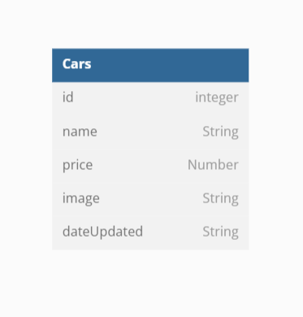

<h3 align="center">Car Management Dashboard</h3>

<!-- ABOUT THE PROJECT -->

## About The Project

This project is to create a dashboard for car rental which includes several features, such as adding new car data, updating new car data and being able to delete car data.

Entity Relationship Diagram


##Build With


<!-- GETTING STARTED -->

## Getting Started

To start developing this project, follow the steps below:

### Prerequisites

The first requirement before starting to develop this project is that you must first initialize npm using the method below

- npm
  ```sh
  npm init
  ```

### Installation

After initializing you have to do the installation below

1. Clone the repo
   ```sh
   git clone https://github.com/NARajab/Car-Management-Dashboard.git
   ```
2. Install NPM packages
   ```sh
   npm install
   ```
3. Create .env file then copy the variables from .env.example then paste them into file .env

4. Run the program with npm
   ```sh
   npm run dev
   ```
5. Open a browser and enter localhost:3000

### The APIs that can be opened in this challenge are as follows:

1. Dashboard Page

   ```api
   /dashboard (GET)
   ```

2. Create Car Page

   ```api
   /create (GET)
   ```

3. Edit Car Page

   ```api
   /edit/:id (GET)
   ```

4. Create Car

   ```api
   /car/add (POST)
   ```

5. Edit Car

   ```api
   /car/update/:id (POST)
   ```

6. Delete Car
   ```
   /car/delete/:id (GET)
   ```
